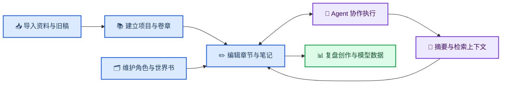

<h1 align="center">OmniFic</h1>

<p align="center">
  <strong>面向长篇小说的本地优先 AI 创作工作台。</strong>
</p>

<p align="center">
  在一个持续工作的空间里管理项目、卷章、笔记、角色、世界书与 Agent，让创作资料真正参与写作。
</p>

<p align="center">
  <a href="https://f0rjay.github.io/OmniFic/">官方网站</a> · 中文 · <a href="./README_EN.md">English</a>
</p>

<p align="center">
  
  
  
</p>

OmniFic 把传统小说写作工具与可执行任务的 AI Agent 放在同一个工作区中。你可以组织长篇正文和设定资料，也可以让 Agent 在权限控制下读取、检索和修改章节、卷、笔记、角色与世界书，而不是把每次对话都变成一次脱离项目的临时问答。

项目采用 Python 后端、React 前端与可选的 Electron 桌面壳，应用数据默认存储在本地 SQLite 中。当前推荐从源码运行。

---

## 📍 快速导航

- [产品全景](#-产品全景)
- [创作工作流](#-创作工作流)
- [核心能力](#-核心能力)
- [适合谁](#-适合谁)
- [快速开始](#-快速开始)
- [当前状态](#-当前状态)
- [文档与参与](#-文档与参与)
- [与 OpenFic 的关系](#-与-openfic-的关系)

## 📋 产品全景

| 能力领域 | OmniFic 可以做什么 |
| --- | --- |
| **长篇写作** | 管理项目、封面、卷、章节与多级笔记；多标签编辑、自动保存、编辑器内查找替换与章节排序 |
| **人物与设定** | 为项目维护角色档案、头像和世界书条目，并按名称或内容检索资料 |
| **资料导入** | 从 TXT 小说建立项目和卷章结构；从 SillyTavern JSON 或常见文档格式导入世界书 |
| **Agent 协作** | 保留任务与会话历史，让 Agent 搜索正文、读取上下文并通过工具修改创作内容 |
| **长上下文管理** | 生成章节摘要和区间摘要，建立章节检索索引，并在长会话中压缩历史、保留任务目标 |
| **模型与提示词** | 配置模型供应商、中转站、LLM、Embedding 与 Rerank 模型，管理推理参数、提示词版本、规则和技能 |
| **多智能体** | 配置主 Agent 与子 Agent、可用工具、技能和委派关系，让规划、写作、审阅等任务分工执行 |
| **创作分析** | 查看写作日历、字数来源、活跃趋势、模型调用、Token、延迟与逐次调用记录 |

## 🔄 创作工作流

OmniFic 围绕“资料进入项目、项目支撑写作、写作沉淀上下文”的循环设计，而不是把编辑器、设定库和 AI 对话拆成互不相干的工具。



## 📚 核心能力

### 项目、卷章与写作编辑

- 创建、搜索、排序和管理小说项目，支持项目简介、封面上传与裁剪
- 使用卷—章结构组织长篇正文，支持创建、重命名、复制、移动、删除和拖拽排序
- 在桌面布局中以多标签页同时打开章节和笔记，保留最近编辑位置
- 使用 TipTap 富文本编辑器编写标题、列表、引用、代码块等内容，并支持撤销、重做和编辑器内查找替换
- 自动保存工作副本，同时提供明确的保存中、已保存、失败和重试状态
- 建立分类化笔记树，支持嵌套分类、移动、复制、隐藏，以及锁定笔记以禁止 Agent 修改

### 角色与世界书

- 按项目维护角色档案、人物描述与头像，支持搜索、收藏、多选和批量操作
- 创建可关联项目的世界书，维护启用或停用的设定条目，并对名称和内容进行检索
- 导入 SillyTavern 世界书 JSON，预览后选择追加或覆盖
- 将 Markdown、PDF、Word、PowerPoint 和 TXT 等资料转换为世界书候选条目
- 可选用模型整理导入结果，包括优化命名、合并重复内容和拆分过长条目

详见[世界书多格式导入](./docs/features/worldbook-import.md)。

### Agent 会话与创作工具

- 为每个项目保留任务列表、会话历史、运行状态与 Token 使用信息
- 允许 Agent 读取、搜索、创建和修改章节、卷、笔记、角色与世界书条目
- 通过工具权限、执行前审批和变更预览控制 Agent 对项目数据的操作
- 支持澄清问题、计划展示、消息排队、取消运行、编辑消息与重新生成
- 支持主 Agent 调度子 Agent，并查看各子任务的排队、运行、等待和完成状态
- 使用 `/` 命令切换模型与推理强度、查看状态、维护任务目标和选择技能
- 将章节、卷、笔记或编辑器中的选中文本直接加入会话上下文

详见[`/` 命令中心](./docs/features/codex-slash.md)与[任务目标持久化](./docs/features/task-goal.md)。

### 摘要、索引与长上下文

- 为章节生成和维护摘要，并进一步汇总为跨章节的区间摘要
- 搜索章节名、人物、地点和摘要内容，检查缺失或过期的摘要
- 使用 Embedding 模型为章节建立分块检索索引，可按全部项目或指定项目启用
- 配置分块大小、重叠范围、自动更新策略，并可选用 Rerank 模型进行二次排序
- 在长会话中压缩历史上下文，同时从持久化任务中恢复目标、规则、技能与必要状态
- 记录索引的新鲜度、失败状态和重建需求，支持按章节补齐、更新或重试

### 模型、提示词与 Agent 定制

- 配置多个模型供应商、Base URL 与 API Key，支持 OpenAI 兼容端点和中转站
- 验证供应商连接并发现可用模型，分别管理 LLM、Embedding 和 Rerank 模型
- 设置默认模型、轻量模型和默认嵌入模型，并调整上下文长度、采样参数和最大输出等配置
- 当中转站无法正确声明模型能力时，可手动覆盖模型是否支持推理强度
- 编辑会话、摘要、压缩和各类 Agent 使用的提示词链，保存版本、预览编译结果、查看差异或恢复默认值
- 管理全局规则、内置或导入的写作技能，以及自定义主 Agent、子 Agent、模型、工具、技能和委派关系
- 为不同工具设置默认权限策略，在自动执行与人工确认之间做出选择

详见[中转站供应商](./docs/features/relay-provider.md)与[模型推理能力](./docs/features/model-reasoning.md)。

### 导入、统计与本地运行

- 导入 TXT 小说时自动检测常见中文编码、章节标题和卷标题，并建立对应的项目、卷与章节
- 在导入前预览章节数量、总字数和解析结果，导入过程中显示实时进度
- 通过写作仪表盘查看年度写作日历、活跃天数、累计字数、字数来源和星期分布
- 通过 LLM 仪表盘查看调用次数、Token 消耗、首 Token 延迟、响应时间、模型分布和项目分布
- 查看逐次模型调用记录，包括输入、输出、工具定义、状态与错误信息
- 使用本地 SQLite 保存主要应用数据，并通过 Alembic 管理数据库迁移
- 提供中英文界面、浅色与深色主题，以及可选的 Electron 桌面打包方案

详见[TXT 小说分卷导入](./docs/features/txt-volume-import.md)与[系统架构](./docs/architecture.md)。

> 📌 **本地优先不等于完全离线：** 项目数据默认保存在本机，但使用云端模型或中转站时，发送给模型的上下文会经过你配置的服务。请根据资料敏感程度选择供应商与部署方式。

## 🎯 适合谁

OmniFic 更适合：

- 需要同时维护正文、人物、世界观、研究资料和长线伏笔的长篇创作者
- 希望 AI 能读取项目上下文并执行具体编辑任务，而不只是提供聊天建议的人
- 使用个人或团队中转站、OpenAI 兼容端点，或希望分别配置 LLM、Embedding 与 Rerank 模型的人
- 想保留任务过程、工具调用、推理状态和模型使用数据，以便复盘创作的人
- 愿意从源码运行，并能接受实验性功能和持续变化的用户

它目前不太适合：

- 希望下载安装后无需配置即可稳定使用的用户
- 需要官方托管云服务、多人实时协作或企业级支持的团队
- 要求稳定桌面安装包、长期兼容承诺或无损迁移保证的生产环境
- 希望在不向任何模型服务发送上下文的情况下使用全部 AI 功能的人

## ⚡ 快速开始

### 环境要求

| 依赖 | 版本 |
| --- | --- |
| Python | 3.12 或 3.13 |
| Node.js | 22+ |
| pnpm | 8+ |
| uv | 最新稳定版 |

### 从源码运行

```bash
git clone https://github.com/F0rJay/OmniFic.git
cd OmniFic

# 终端 1：后端
cd backend
uv sync
uv run uvicorn app.main:app --host 127.0.0.1 --port 8001 --app-dir .
```

另开一个终端：

```bash
cd OmniFic/frontend
pnpm install
pnpm dev
```

打开 `http://127.0.0.1:9000`。后端默认运行在 `http://127.0.0.1:8001`，健康检查地址为 `http://127.0.0.1:8001/api/v1/health`。

数据库初始化、桌面端开发和更多命令见[开发环境搭建](./docs/develop/setup.md)。

## ⚠️ 当前状态

OmniFic 目前由个人维护，处于实验性开发阶段。

- 项目从 OpenFic v0.7.5 分支而来，但不承诺继续同步上游
- 功能、交互、提示词与数据结构可能随着真实使用继续调整
- 当前推荐从源码运行；桌面包、PyPI 包和远程 Docker 镜像不作为稳定发行渠道
- 数据库升级或从 OpenFic 迁移前请完整备份数据，目前不承诺直接复制数据即可无损迁移
- Issue、讨论和 PR 都很欢迎，但是否采用仍取决于项目方向与维护能力

## 🔗 文档与参与

- [文档导航](./docs/README.md)：全部现有功能、架构、开发与运维文档
- [系统架构](./docs/architecture.md)：前端、后端、Agent Runtime、存储与桌面端结构
- [开发环境搭建](./docs/develop/setup.md)：本地开发、数据库与常用命令
- [测试指南](./docs/develop/testing.md)：后端与前端验证方式
- [贡献指南](./CONTRIBUTING.md)：提交约定与协作流程
- [Issues](https://github.com/F0rJay/OmniFic/issues)：问题反馈和功能讨论
- [Pull Requests](https://github.com/F0rJay/OmniFic/pulls)：代码与文档贡献

## 🔗 与 OpenFic 的关系

OmniFic Fork 自 [OpenFic v0.7.5](https://github.com/syrizelink/OpenFic)。项目的基础架构、主要产品形态，以及世界观管理、写作编辑器、Agent Runtime 和本地数据能力等核心基础都来自 OpenFic。OmniFic 在此基础上独立发展，但不是 OpenFic 的替代，也不代表一个”更正确”的方向。

<details>
<summary><strong>💡 为什么成为独立分支</strong></summary>

这个分支首先服务于维护者自己的长篇创作实践。后续工作更关注中转站模型接入、命令式 Agent 交互、资料导入、任务连续性、检索上下文和运行过程可见性。这些取舍带有明确的个人偏好，因此选择作为独立项目维护，而不是要求上游接受同一套产品方向。

</details>

---

其他启发来源包括：

- [SillyTavern](https://github.com/SillyTavern/SillyTavern)：世界书格式与生态参考
- [Claude Code](https://claude.ai/code)：命令式 Agent 交互参考
- [oh-story-claudecode](https://github.com/worldwonderer/oh-story-claudecode)：写作 Skill 参考

## 📦 许可证

OmniFic 依据 [Apache License 2.0](./LICENSE) 开源。使用或分发时，也请保留上游项目要求的版权与许可证声明。
