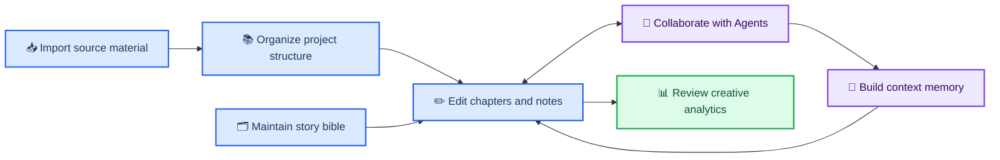

<h1 align="center">OmniFic</h1>

<p align="center">
  <strong>A local-first AI writing workspace for long-form fiction.</strong>
</p>

<p align="center">
  Keep projects, volumes, chapters, notes, characters, worldbooks, and Agents in one continuous creative workspace.
</p>

<p align="center">
  <a href="./README.md">中文</a> · English
</p>

<p align="center">
  
  
  
</p>

OmniFic combines a conventional fiction-writing environment with AI Agents that can carry out project-level tasks. You can organize a long manuscript and its story bible, then allow an Agent—under explicit tool permissions—to read, search, and edit chapters, volumes, notes, characters, and worldbook entries instead of treating every conversation as a context-free chat.

The project uses a Python backend, a React frontend, and an optional Electron shell. Primary application data is stored locally in SQLite. Running from source is currently the recommended way to use it.

---

## 📍 Quick navigation

- [Product overview](#-product-overview)
- [Writing workflow](#-writing-workflow)
- [Core capabilities](#-core-capabilities)
- [Who it is for](#-who-it-is-for)
- [Quick start](#-quick-start)
- [Project status](#-project-status)
- [Documentation and contribution](#-documentation-and-contribution)
- [Relationship to OpenFic](#-relationship-to-openfic)

## 📋 Product overview

| Area | What OmniFic provides |
| --- | --- |
| **Long-form writing** | Projects, covers, volumes, chapters, nested notes, multi-tab editing, autosave, find and replace, and chapter ordering |
| **Characters and lore** | Project-scoped character profiles, portraits, worldbooks, searchable entries, and project associations |
| **Material import** | TXT novel import with volume and chapter structure, plus worldbook import from SillyTavern JSON and common document formats |
| **Agent collaboration** | Persistent tasks and transcripts, with tools that let Agents search the manuscript, inspect context, and edit creative material |
| **Long-context support** | Chapter and range summaries, chapter retrieval indexes, conversation compaction, and persistent task goals |
| **Models and prompts** | Providers, relays, LLM, Embedding and Rerank models, reasoning configuration, versioned prompt chains, rules, and skills |
| **Multi-agent work** | Configurable primary and delegated Agents with model, tool, skill, and delegation assignments for planning, drafting, and review |
| **Creative analytics** | Writing activity, source attribution, model calls, tokens, latency, and individual request records |

## 🔄 Writing workflow

OmniFic is designed around a loop in which source material enters the project, the project supports drafting, and each round of writing produces better context for the next one. The editor, story bible, and AI conversation are parts of the same workflow.



## 📚 Core capabilities

### Projects, volumes, chapters, and editing

- Create, search, sort, and manage fiction projects with descriptions, cover uploads, and cover cropping
- Organize manuscripts into volumes and chapters with create, rename, duplicate, move, delete, and drag-to-reorder operations
- Open chapters and notes in multiple tabs in the desktop layout while preserving the most recently edited location
- Write with a TipTap rich-text editor supporting headings, lists, quotes, code blocks, undo, redo, and in-editor find and replace
- Keep an autosaved working copy with explicit saving, saved, failed, and retry states
- Build categorized note trees with nested categories, moving, duplication, visibility controls, and locks that prevent Agent edits

### Characters and worldbooks

- Maintain project-scoped character profiles, descriptions, and portraits with search, favorites, multi-select, and batch actions
- Create worldbooks that can be associated with projects, manage enabled and disabled entries, and search names and content
- Import SillyTavern worldbook JSON with a preview and append-or-overwrite modes
- Convert Markdown, PDF, Word, PowerPoint, TXT, and similar material into candidate worldbook entries
- Optionally use a model to improve entry names, merge repeated material, and split entries that are too long

See [multi-format worldbook import](./docs/features/worldbook-import.md).

### Agent sessions and creative tools

- Keep a task list, conversation history, runtime state, and token usage for each project
- Let Agents read, search, create, and edit chapters, volumes, notes, characters, and worldbook entries
- Control project mutations through tool permissions, pre-execution approval, and change previews
- Support clarification questions, plan displays, queued messages, cancellation, message editing, and regeneration
- Allow a primary Agent to delegate work to subagents and expose each child task's queued, running, waiting, and completed state
- Use `/` commands to switch models and reasoning effort, inspect status, maintain a persistent task goal, and select skills
- Add chapters, volumes, notes, or selected editor text directly to a conversation

See the [`/` command center](./docs/features/codex-slash.md) and [persistent task goals](./docs/features/task-goal.md).

### Summaries, retrieval, and long context

- Generate and maintain per-chapter summaries, then combine them into longer cross-chapter range summaries
- Search chapter names, characters, locations, and summary content while identifying missing or outdated summaries
- Build chunked chapter indexes with an Embedding model and enable them for all projects or selected projects
- Configure chunk size, overlap, automatic indexing strategy, and optional Rerank-based secondary ordering
- Compact long conversation history while restoring goals, rules, skills, and required state from the persistent task
- Track index freshness, failures, and rebuild requirements, with per-chapter actions for filling gaps, updating stale content, and retrying failures

### Models, prompts, and Agent customization

- Configure multiple model providers, Base URLs, and API keys, including OpenAI-compatible endpoints and relays
- Validate provider connections and discover available models, with separate management for LLM, Embedding, and Rerank workloads
- Choose default, lightweight, and embedding models while tuning context length, sampling controls, and maximum output
- Override reasoning-capability detection when a relay does not describe a model accurately
- Edit the prompt chains used for sessions, summaries, compaction, and Agents; save versions, preview compiled prompts, compare changes, or restore defaults
- Manage global rules, built-in or imported writing skills, and custom primary or delegated Agents with their models, tools, skills, and delegation relationships
- Set default permission policies for individual tools to balance autonomous execution and human confirmation

See [relay providers](./docs/features/relay-provider.md) and [model reasoning capabilities](./docs/features/model-reasoning.md).

### Import, analytics, and local operation

- Import TXT novels with automatic detection of common Chinese encodings, chapter headings, and volume headings
- Preview chapter count, total word count, and parsed structure before import, with live progress during project creation
- Review yearly writing calendars, active days, cumulative word counts, source attribution, and weekday activity
- Review LLM calls, token consumption, time to first token, total latency, model distribution, and project distribution
- Inspect individual model-call records, including input, output, tool definitions, status, and errors
- Store primary application data in local SQLite and manage schema changes with Alembic migrations
- Use Chinese or English, light or dark themes, and an optional Electron packaging path for desktop builds

See [volume-aware TXT import](./docs/features/txt-volume-import.md) and the [system architecture](./docs/architecture.md).

> 📌 **Local-first does not mean fully offline:** project data is stored locally by default, but context sent to a cloud model or relay passes through the service you configure. Choose providers and deployment methods according to the sensitivity of your material.

## 🎯 Who it is for

OmniFic is most likely to suit:

- Long-form writers who need to maintain manuscripts, characters, lore, research, and long-running plot threads together
- People who want AI to inspect project context and carry out concrete editing tasks instead of only offering conversational suggestions
- Users of personal or team relays and OpenAI-compatible endpoints, or anyone who wants separate LLM, Embedding, and Rerank configuration
- Writers who want to preserve task history, tool calls, reasoning state, and model-usage data for later review
- Users comfortable running from source and accepting experimental features and continuing change

It is currently less suitable for:

- People looking for a polished download-and-run product with no configuration
- Teams that require an officially hosted cloud service, real-time multiplayer collaboration, or enterprise support
- Production environments that require stable installers, long-term compatibility guarantees, or guaranteed lossless migration
- Users who need every AI capability to work without sending any context to an external model service

## ⚡ Quick start

### Requirements

| Dependency | Version |
| --- | --- |
| Python | 3.12 or 3.13 |
| Node.js | 22+ |
| pnpm | 8+ |
| uv | Latest stable release |

### Run from source

```bash
git clone https://github.com/F0rJay/OmniFic.git
cd OmniFic

# Terminal 1: backend
cd backend
uv sync
uv run uvicorn app.main:app --host 127.0.0.1 --port 8001 --app-dir .
```

Open a second terminal:

```bash
cd OmniFic/frontend
pnpm install
pnpm dev
```

Open `http://127.0.0.1:9000`. The backend runs at `http://127.0.0.1:8001` by default, with a health check at `http://127.0.0.1:8001/api/v1/health`.

See the [development setup guide](./docs/develop/setup.md) for database initialization, desktop development, and additional commands.

## ⚠️ Project status

OmniFic is personally maintained and remains experimental.

- It forked from OpenFic v0.7.5 but does not promise continuing upstream synchronization
- Features, interactions, prompts, and data structures may change as actual usage evolves
- Running from source is recommended; desktop packages, the PyPI package, and remote Docker images are not presented as stable distribution channels
- Back up all data before database upgrades or OpenFic migration; copying an existing data directory is not guaranteed to be lossless
- Issues, discussions, and pull requests are welcome, but acceptance depends on project direction and maintenance capacity

## 🔗 Documentation and contribution

- [Documentation index](./docs/README.md): all current feature, architecture, development, and operations notes
- [System architecture](./docs/architecture.md): frontend, backend, Agent Runtime, storage, and desktop structure
- [Development setup](./docs/develop/setup.md): local development, database setup, and common commands
- [Testing guide](./docs/develop/testing.md): backend and frontend verification
- [Contribution guide](./CONTRIBUTING.md): contribution conventions and workflow
- [Issues](https://github.com/F0rJay/OmniFic/issues): bug reports and feature discussion
- [Pull Requests](https://github.com/F0rJay/OmniFic/pulls): code and documentation contributions

## 🔗 Relationship to OpenFic

OmniFic was forked from [OpenFic v0.7.5](https://github.com/syrizelink/OpenFic). Its foundational architecture, primary product shape, worldbuilding management, writing editor, Agent Runtime, and local data capabilities all originate in OpenFic. OmniFic now develops independently, but it is not intended as a replacement or a claim to represent a “more correct” direction.

<details>
<summary><strong>💡 Why it became an independent fork</strong></summary>

This branch serves the maintainer's own long-form writing practice first. Its later work emphasizes relay-based model access, command-driven Agent interaction, source-material import, task continuity, retrieval context, and visibility into runtime behavior. Those priorities reflect a specific personal workflow, so they are maintained as an independent project rather than proposed as the direction upstream should follow.

</details>

---

Other sources of inspiration include:

- [SillyTavern](https://github.com/SillyTavern/SillyTavern): worldbook formats and ecosystem references
- [Claude Code](https://claude.ai/code): command-driven Agent interaction
- [oh-story-claudecode](https://github.com/worldwonderer/oh-story-claudecode): writing Skill references

## 📦 License

OmniFic is released under the [Apache License 2.0](./LICENSE). Please retain any copyright and license notices required by the upstream project when using or redistributing it.
