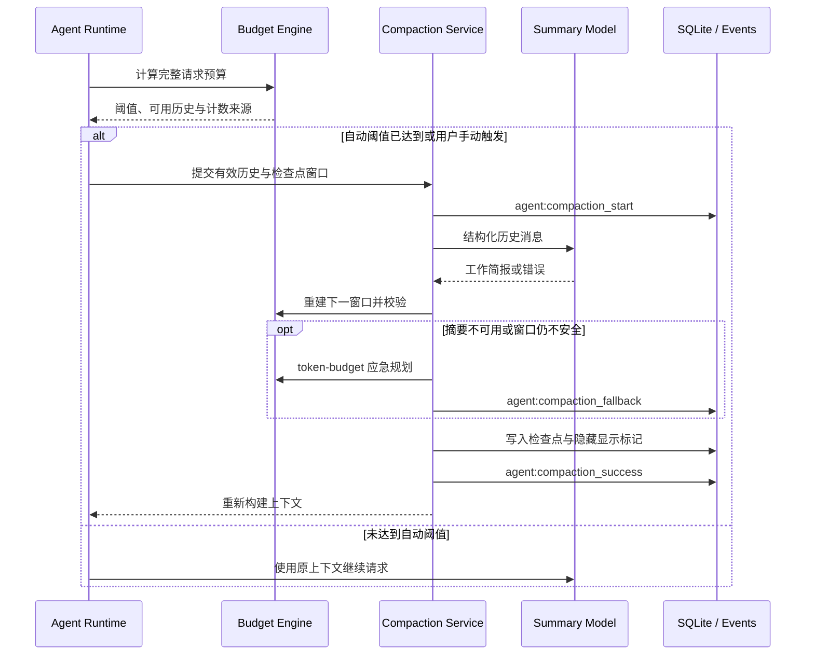
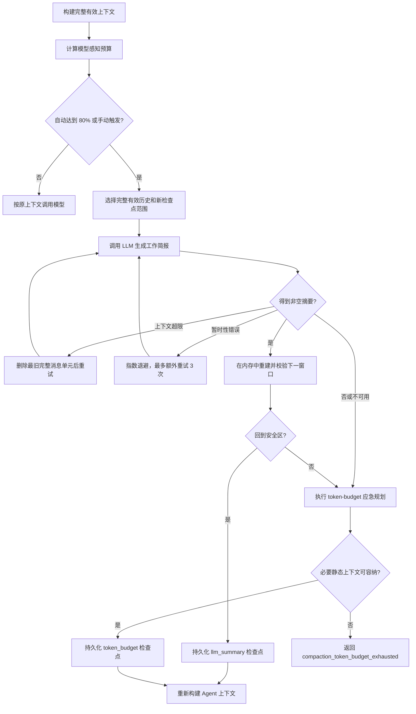

# 上下文压缩机制

_说明 OmniFic 如何在长 Agent 会话中计算上下文预算、生成摘要、执行应急重置并恢复可继续工作的模型输入。_

---

> **状态**：Active · **代码范围**：`backend/app/agent_runtime/context/compaction/`、`backend/app/agent_runtime/graph/react_agent.py`、`backend/app/agent_runtime/persistence/`、`frontend/src/features/assistant/` · **审查日期**：2026-07-31 · **触发条件**：预算算法、压缩策略、持久化字段、生命周期事件或前端压缩交互变更

## 📋 目标与边界

上下文压缩用于让长 Agent 会话在模型输入窗口内继续运行。它不删除原始会话记录，而是在下一次上下文构建时，用一个持久化检查点覆盖已经压缩的历史。

当前实现保证：

- 按当前模型、输出预留、固定上下文、工具 Schema 和协议开销计算可用历史预算。
- 默认在历史达到可用预算的 80% 时自动压缩，也允许用户在主 Agent 空闲时手动压缩。
- 优先让 LLM 把完整有效历史整理为结构化工作简报。
- 摘要模型不可用或摘要后仍不安全时，使用确定性的 `token_budget` 策略建立干净窗口。
- 系统提示、任务目标、规则、技能和其他非历史上下文不参与删除；任务目标会从数据库重新读取。
- 原始消息和历代压缩记录仍可审计，实际模型输入只应用最新检查点。

当前不处理多模态内容的专门压缩，也不生成可移植的加密压缩状态。模型调用仍使用项目已有的供应商配置和本地持久化边界。

## 🏗️ 架构概览



核心职责分布如下：

| 组件 | 职责 | 主要位置 |
|---|---|---|
| 上下文构建 | 组装系统提示、规则、技能、任务目标、历史与临时输入 | `backend/app/agent_runtime/context/build_context.py` |
| 预算与计数 | 选择 tokenizer/估算策略，计算自动阈值与压缩后安全区 | `context/compaction/budget.py`、`token_estimator.py` |
| 窗口与覆盖 | 选择完整有效历史，生成非重叠检查点范围，恢复最新摘要 | `context/compaction/window.py`、`overlay.py` |
| 压缩服务 | 调用摘要模型、重试、校验、回退、取消和事件发布 | `context/compaction/service.py` |
| 应急策略 | 在不调用摘要模型的情况下按预算保留最近用户指令 | `context/compaction/token_budget.py` |
| 持久化 | 写入、复制、失效压缩检查点 | `backend/app/agent_runtime/persistence/compaction_repo.py` |
| 用户交互 | 手动压缩、上下文状态、生命周期消息 | `frontend/src/features/assistant/` |

## 📊 模型感知预算

### 预算公式

自动压缩不是按模型声明窗口的固定 80% 直接触发。系统先扣除输出预留、安全余量和所有非历史输入：

```text
effective_input_limit
= max_context_tokens
- output_reserve_tokens
- safety_margin_tokens

available_history_tokens
= effective_input_limit
- reserved_tokens
- tool_schema_tokens
- request_overhead_tokens

trigger_tokens = available_history_tokens × 0.8
```

其中：

- `reserved_tokens`：系统提示、任务目标、规则、技能和当前运行时临时上下文等非历史消息。
- `tool_schema_tokens`：当前 Agent 可用工具的 JSON Schema；自动压缩路径会把它计入预算。
- `request_overhead_tokens`：消息协议的单次请求封装开销。
- `output_reserve_tokens`：模型配置中的 `max_tokens`；未配置时使用 4096。
- `safety_margin_tokens`：按计数可信度增加的保守余量。

只有 `history_tokens > 0`、可用历史预算为正且 `history_tokens >= trigger_tokens` 时，才会自动压缩。压缩后的候选窗口还必须同时满足：总输入小于有效输入上限，且历史部分重新回到触发线以下。

### 计数策略

计数器会覆盖消息角色和封装、正文、名称、工具调用 ID、assistant 工具调用、附加参数、工具 Schema 与请求开销。

| 计数来源 | 使用场景 | 估算系数 | 安全余量 |
|---|---|---:|---:|
| `model_tokenizer` | OpenAI、Azure OpenAI；按模型选择 tokenizer，未知模型回退到 `o200k_base` | 1.0 | `max(512, 窗口的 1%)` |
| `compatible_estimate` | OpenAI-compatible 供应商 | 1.1 | `max(1024, 窗口的 3%)` |
| `fallback_estimate` | 未知供应商，使用 `o200k_base` 估算 | 1.2 | `max(2048, 窗口的 5%)` |

兼容估算当前覆盖 `deepseek`、`groq`、`huggingface`、`mistral`、`nvidia-ai-endpoints`、`ollama`、`openai-compatible` 和 `openrouter`。估算系数与安全余量用于降低第三方端点分词差异带来的溢出风险，不代表供应商的精确 tokenizer。

### 与界面上下文状态的区别

Assistant 右上角的圆环显示当前会话输入 token 与模型声明上下文窗口的比例，用于观察状态。自动压缩阈值使用的是扣除固定输入、工具、输出预留和安全余量后的 `available_history_tokens`，因此自动压缩可能在圆环达到 80% 之前发生；两者不是同一个百分比。

## 🔄 自动与手动流程



### 自动压缩

Agent Runtime 在每次模型调用前对即将发送的完整输入检查预算。达到阈值后，它先完成压缩，再从持久化消息和最新检查点重新构建上下文，随后才继续原来的模型请求。

### 手动压缩

前端压缩按钮调用：

```text
POST /api/v1/agent/sessions/{session_id}/compaction
```

手动和自动路径共享窗口选择、摘要、校验、应急策略、持久化及事件协议。以下情况不能从界面手动压缩：

- 当前没有主 Agent 会话，或正在查看子 Agent。
- 会话正在加载、运行或已经处于压缩中。
- 会话正在等待用户回答澄清问题或批准操作。
- 上次检查点之后没有新的可压缩原始消息。

前端会显示“正在压缩上下文”和“上下文已压缩”状态。压缩成功不会清除聊天列表中的原始内容；它改变的是以后发送给模型的有效历史。

## 🧠 LLM 摘要策略

默认策略名为 `llm_summary`。压缩提示词来自 `backend/app/prompts/session/compaction.yaml`，Prompt Chain ID 是 `session-compaction`，用户可以通过提示词链版本机制调整。

### 摘要输入与格式

- 摘要输入是应用最新检查点后得到的完整有效历史，而不是只总结上次检查点后的增量消息。
- 历史以 LangChain 的 `system`、`user`、`assistant`、`tool` 结构化消息传递，不先拼成一个无角色字符串。
- 提示词要求按“目标”“决策和理由”“相关内容”“错误与修复”“待办事项”组织工作简报，并保留路径、标识符和具体状态。
- assistant 工具调用与匹配的 tool 结果会被视为不可拆分的消息单元。

### 重试与校验

- 408、429、5xx、连接错误和超时错误采用指数退避，初始延迟 0.2 秒，带随机抖动，首次失败后最多额外重试 3 次。
- 摘要请求自身超过模型上下文时，按完整消息单元删除最旧历史后重试，避免留下孤立工具结果。
- 空摘要会转换为 `compaction_empty_summary`。
- 摘要返回后不会立即写数据库；系统先在内存中应用摘要和最近用户消息，再用同一模型预算重新校验。

## 🛡️ token-budget 应急策略

`token_budget` 是不依赖摘要模型的确定性回退路径。它在以下 LLM 摘要失败码出现时启用：

| 回退原因 | 含义 |
|---|---|
| `prompt_error` | 压缩提示词无法加载或配置无效 |
| `llm_error` | 摘要模型客户端或请求最终失败 |
| `compaction_empty_summary` | 模型返回空摘要 |
| `compaction_context_unsafe` | 摘要后的候选窗口仍未回到安全区 |

应急策略执行以下操作：

1. 保留当前系统提示、任务目标、规则、技能和其他静态上下文。
2. 用固定重置说明替代旧摘要，明确旧 assistant 回复与工具调用已移除。
3. 对最近用户指令的保留预算做二分搜索，在安全区内尽量保留更多内容，上限为 20000 token。
4. 如果边界落在一条长用户消息中间，从消息中部截断并插入 `…tokens truncated…`。
5. 保留检查点之后的新消息，不改写原始数据库消息。

如果连零条旧用户消息都无法与必要静态上下文共同放入安全区，系统返回 `compaction_token_budget_exhausted`，不会伪造一个不可执行的成功结果。

用户取消、前后置 hook 中止、检查点冲突、持久化失败和非预期校验异常不会被降级成 `token_budget`，因为这些问题不能通过删除更多对话历史安全解决。

## 💾 检查点与恢复

### 非重叠范围

每次摘要面向完整有效历史，但持久化的 `start_seq` 到 `end_seq` 只覆盖上次检查点之后的新原始消息，因此同一会话内检查点范围不重叠，`generation` 每次递增。

恢复上下文时只选择最新检查点：

1. 收集该检查点范围结束前的最近真实用户消息。
2. 以 user 消息注入最新摘要：

   ```xml
   <compaction-summary>
   ...
   </compaction-summary>
   ```

3. 原样追加检查点之后的新消息。

系统不会把多代摘要逐层叠加。`llm_summary` 最多保留 20000 token 的最近用户消息；`token_budget` 使用该检查点持久化的 `retained_user_tokens`，以便重启后重建出与校验时相同的窗口。

### 持久化字段

`agent_context_compactions` 表保存：

| 类别 | 字段 |
|---|---|
| 归属 | `session_id`、`task_id`、`project_id` |
| 范围 | `start_seq`、`end_seq`、`generation` |
| 结果 | `summary`、`trigger`、`strategy`、`created_at` |
| 输入/输出 | `source_input_tokens`、`model_input_tokens`、`summary_tokens`、`post_compaction_tokens` |
| 保留/裁剪 | `retained_user_tokens`、`dropped_turn_count`、`dropped_message_count` |

写入前会校验序号范围、策略和所有非负指标，并拒绝同一会话内相交的范围。另有一条 `message_type="compaction"`、`llm_visibility="hidden"` 的消息作为用户可见分隔标记，它不会再次进入模型上下文。

### 编辑与会话分叉

- 编辑旧消息时，所有与编辑序号相交或位于其后的压缩检查点都会失效并删除，避免继续使用基于旧内容的摘要。
- 会话 fork 时，只有原始序号范围能够完整、连续映射到新会话的检查点才会复制；部分映射的检查点会被跳过。

## ⚙️ 生命周期与取消

生命周期事件包括：

| 事件 | 含义 |
|---|---|
| `agent:compaction_start` | 已选定窗口，开始压缩 |
| `agent:compaction_fallback` | LLM 摘要不可用，已切换到 `token_budget` |
| `agent:compaction_success` | 检查点和显示标记已持久化 |
| `agent:compaction_error` | 压缩以稳定错误码终止 |
| `agent:compaction_cancelled` | 压缩被用户或 hook 取消 |

内部阶段依次可能为 `pre_compact`、`prompt_build`、`model_request`、`retry_backoff`、`result_validation`、`token_budget_fallback`、`persistence`、`post_compact` 和 `completed`。

模型请求、退避等待、前后置 hook 和应急规划都响应取消。持久化前取消不会写入检查点；检查点已写入后再由 `post_compact` hook 中止，取消事件会携带 `persisted=true`、检查点 ID 和最终策略，调用方不能把它当成完全回滚。

## 📈 事件与指标

触发事件和隐藏显示标记中的 `context_budget` 包含：

- `history_tokens`
- `reserved_tokens`
- `available_history_tokens`
- `trigger_tokens`
- `tool_schema_tokens`
- `request_overhead_tokens`
- `output_reserve_tokens`
- `safety_margin_tokens`
- `effective_input_limit`
- `estimated_input_tokens`
- `counter_source`
- `encoding_name`

成功记录还包含模型实际输入、摘要大小、压缩后窗口大小、保留用户 token、裁剪轮次和消息数，以及 `trigger`、`strategy`、`generation`。`context_budget` 是事件和显示标记的诊断快照，不单独增加数据库列。

调试时应先看 `counter_source` 和 `effective_input_limit`，再判断阈值是否合理。第三方兼容端点的本地估算与供应商最终计费 token 可能不同。`model_input_tokens` 为 0 可能表示当前使用不调用模型的 `token_budget` 策略，或供应商没有返回摘要调用用量，并不等于没有发生压缩。

## 🔧 调试、测试与维护

### 关键错误码

| 错误码 | 常见原因 | 处理方向 |
|---|---|---|
| `no_compactable_window` | 没有新原始消息可形成下一检查点 | 继续会话后再压缩 |
| `compaction_token_budget_exhausted` | 固定上下文本身已占满安全窗口 | 减少规则、技能、附件或工具，或换用更大窗口模型 |
| `compaction_conflict` | 并发请求写入了相交范围 | 刷新会话状态后重试 |
| `compaction_persist_failed` | 检查点数据库写入失败 | 检查数据库和日志，不要把它当作摘要模型故障 |
| `compaction_display_persist_failed` | 用户可见分隔标记写入失败 | 检查消息持久化；检查点可能已经写入 |
| `compaction_validation_failed` | 结果校验发生非预期代码错误 | 查看后端异常堆栈并修复校验逻辑 |

### 回归测试

```bash
cd backend
pytest tests/agent_runtime/context/ -v
pytest tests/agent_runtime/persistence/test_compaction_repo.py -v
pytest tests/agent_runtime/test_agent_compaction_api.py -v
pytest tests/agent_runtime/test_replay_buffer.py -v

cd ../frontend
pnpm test -- agent-socket-events
pnpm type-check
```

修改预算、窗口、覆盖或持久化逻辑时，至少覆盖：阈值边界、工具 Schema 预算、摘要后校验、上下文超限裁剪、暂时性错误重试、应急策略、取消阶段、非重叠范围、编辑失效、fork 映射和 Socket 事件恢复。

相关入口见[系统架构](../architecture.md)、[术语表](../glossary.md)、[用户指南](../user-guide.md)和[任务目标持久化](./task-goal.md)。
